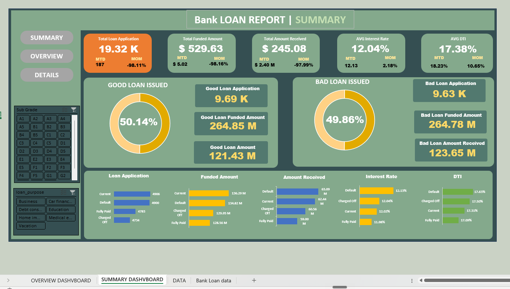
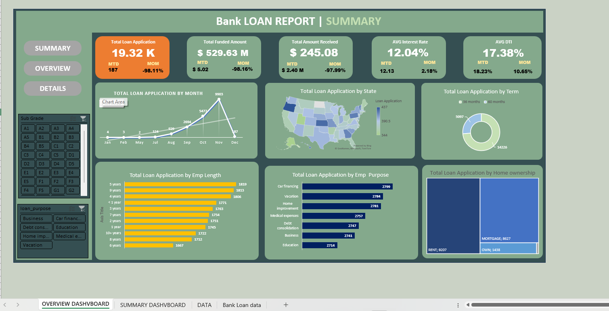

# 🏦 Bank Loan Report — Excel Analytics Dashboard

### Tracking Loan Volume, Funding, Repayment & Borrower Risk Across 19,323 Loans

An interactive Excel dashboard that turns a 19,323-record bank loan dataset into a decision-ready view of portfolio health — covering application volume, funded vs. received amounts, good-vs-bad loan quality, and borrower risk (interest rate & DTI) sliced by state, term, purpose, employment, and home ownership.

> Built as a portfolio project demonstrating end-to-end dashboard design in Excel — data modelling, KPI logic, slicer-driven interactivity, and executive reporting.

---

## 📊 Summary Dashboard

The headline view. Five KPI tiles report **Month-to-Date (MTD)** and **Month-over-Month (MoM)** movement, followed by a good-vs-bad loan split and a status breakdown across every key metric.

**Key performance indicators**

| KPI | Value | MTD | MoM |
|---|---|---|---|
| Total Loan Applications | **19.32K** | 187 | −98.11% |
| Total Funded Amount | **$529.63M** | $5.02M | −98.16% |
| Total Amount Received | **$245.08M** | $2.40M | −97.99% |
| Average Interest Rate | **12.04%** | 12.13% | +2.18% |
| Average DTI | **17.38%** | 18.23% | +10.65% |

*(The steep MoM drops reflect December being a partial/current month — only 187 applications recorded MTD vs. the November peak.)*

**Good Loan vs. Bad Loan**

| | Good Loan | Bad Loan |
|---|---|---|
| Share of applications | **50.14%** | **49.86%** |
| Applications | 9.69K | 9.63K |
| Funded amount | $264.85M | $264.78M |
| Amount received | $121.43M | $123.65M |

**By loan status** (applications): Current 4,906 · Default 4,900 · Fully Paid 4,783 · Charged Off 4,734. Default and Charged-Off loans carry the highest average interest rate (12.13% / 12.04%) and DTI (17.63% / 17.50%) — exactly the risk pattern you'd expect.

---

## 🗺️ Overview Dashboard

The "where and who" view — the same KPI header, then six breakdowns that profile the borrower base.

- **By month:** applications ramp from single digits in early months to a **November peak of 9,903**, before December's partial month (187).
- **By term:** 60-month loans dominate at **14,226** vs. 5,097 for 36-month — borrowers lean toward longer repayment.
- **By home ownership:** **Rent 9,207 · Mortgage 8,627 · Own 1,438** — renters and mortgage-holders make up the bulk of applicants.
- **By purpose:** fairly even demand led by **Car financing (2,799)**, Vacation (2,784), and Home improvement (2,781), down to Education (2,714).
- **By employment length:** spread across all tenures, topped by 5-year (1,819) and 9-year (1,813) employees.
- **By state:** a US choropleth highlighting geographic concentration of applications.

---

## 🧮 Metric Definitions

| Metric | Definition |
|---|---|
| **Good Loan** | Loans that are *Fully Paid* or *Current* — performing as agreed |
| **Bad Loan** | Loans that are *Charged Off* or in *Default* — non-performing |
| **DTI** | Debt-to-Income ratio — total debt payments ÷ income; higher = more stretched borrower |
| **MTD** | Month-to-Date — cumulative value for the latest (in-progress) month |
| **MoM** | Month-over-Month — % change vs. the previous full month |
| **Funded vs. Received** | Funded = amount lent out; Received = amount repaid back so far |

---

## 🗂️ Dataset

The workbook is driven by a single loan-level table of **19,323 records**, with fields including:

`id` · `loan_status` · `loan_amount` · `total_payment` · `int_rate` · `dti` · `installment` · `annual_income` · `term` · `loan_purpose` · `sub_grade` · `home_ownership` · `emp_length` · `address_state` · `issue_date` · `last_payment_date` · `verification_status` · plus borrower and credit attributes.

Every chart and KPI is computed from this table, so filtering the **Sub Grade** and **Loan Purpose** slicers updates the entire report live.

---

## 🛠️ How It's Built

| Sheet | Purpose |
|---|---|
| `SUMMARY DASHBOARD` | KPI tiles, good/bad loan split, status breakdown charts |
| `OVERVIEW DASHBOARD` | Time, geography, term, purpose, employment & ownership breakdowns |
| `DATA` | Cleaned, structured analysis table feeding the dashboards |
| `Bank Loan data` | Source loan-level dataset |

**Techniques used:** PivotTables & PivotCharts, slicers for cross-filtering (Sub Grade, Loan Purpose), KPI cards with MTD/MoM logic, conditional formatting, donut/bar/line/map visuals, and a clean navigation layout (Summary · Overview · Details).

---

## ▶️ How to Use

1. Download [`data/Bank_Loan_Reports.xlsx`](data/Bank_Loan_Reports.xlsx).
2. Open in Excel (desktop recommended for slicers and the map chart).
3. Use the **Sub Grade** and **Loan Purpose** slicers to filter; switch between the **Summary** and **Overview** tabs for different lenses on the portfolio.

---

## 🧠 Skills Demonstrated

Data cleaning & modelling · PivotTable/PivotChart design · KPI definition (MTD/MoM) · risk segmentation (good vs. bad loans, DTI, interest rate) · interactive slicer dashboards · executive report layout & storytelling.

---

## 📜 License

Released under the [MIT License](LICENSE). Dataset is sample/illustrative loan data used for portfolio and educational purposes.
